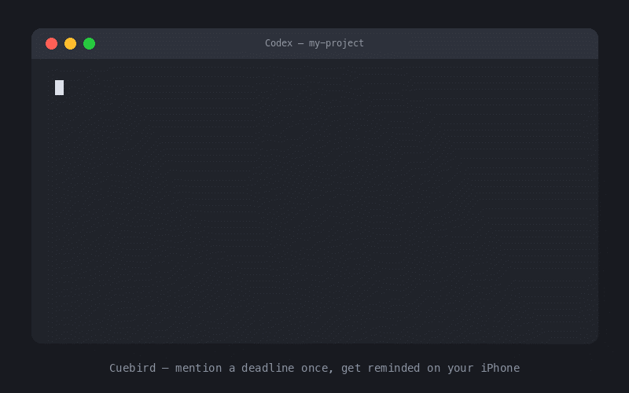

# Cuebird for Codex

[](https://github.com/itsmynamee/cuebird-codex/actions/workflows/test.yml)
[](https://github.com/itsmynamee/cuebird-codex/releases)
[](LICENSE)
[](#requirements)

**Mention a deadline once. Get a verified reminder on your Apple devices —
with enough project context for Codex to resume the work later.**



Cuebird adds four focused skills and a `SessionStart` hook to Codex. When a
future checkpoint appears in a task, it offers once to create an Apple
Reminder. Accepted reminders are read back for verification and recorded in a
local journal with the project path and a self-contained continuation prompt.

## Why Cuebird

- **Survives the session:** reminders fire on your Apple devices even when the
  Mac is off and Codex is closed.
- **Verified delivery path:** Cuebird reads every new reminder back before
  reporting success.
- **Context comes back:** say `reminder: <key>` later and Codex can restore the
  saved project context and next steps.
- **Consent first:** it never creates, completes, or cancels a reminder without
  asking.
- **Local by design:** no account, API key, daemon, telemetry, or hosted service.

## Requirements

- macOS with Apple Reminders enabled
- iCloud Reminders for delivery to iPhone, iPad, or Apple Watch
- Codex desktop or another Codex surface that supports plugins and hooks

## Install

```bash
codex plugin marketplace add itsmynamee/cuebird-codex
codex plugin add cuebird@cuebird
```

Review and trust Cuebird's `SessionStart` hook when Codex prompts you. Start a
new task after installation so Codex loads the skills and hook.

You can also install **Cuebird** from the Plugins directory in the Codex desktop
app after adding the marketplace.

## How it works

1. The session hook tells Codex to notice actionable future checkpoints.
2. Codex offers one meaningful reminder at a natural pause.
3. After consent, Cuebird creates the reminder and verifies it by reading it back.
4. A local journal stores the project, context, and continuation prompt.
5. When the reminder fires, `reminder: <key>` restores the work context.

## Skills

- `remind` — create a reminder or offer one for a concrete checkpoint.
- `reminders` — review and manage accepted, declined, deferred, and completed entries.
- `resume` — restore saved project context after a reminder fires.
- `doctor` — run end-to-end diagnostics and an optional update check.

## Privacy

- Reminder content is stored in Apple Reminders and synced according to your
  iCloud settings.
- The decision journal stays on your Mac under `~/.codex/cuebird/`.
- Cuebird has no telemetry and makes no automatic network requests.
- The only network request is the explicit `doctor` update check against the
  public GitHub Releases API.

## Verified release gate

Version 0.2.0 passed the complete real-device path on macOS: create, read-back,
iCloud sync, notification on iPhone at the scheduled minute, context recovery,
complete, delete, and final missing-state verification.

## Development

```bash
git clone https://github.com/itsmynamee/cuebird-codex.git
cd cuebird-codex
bash tests/run.sh
```

The machine-independent suite covers date validation, journal transitions,
concurrent writes, malformed entries, reminder reconciliation, and orchestration.
The real Apple Reminders test is an explicit local release gate:

```bash
bash tests/test_adapter.sh
```

That test creates and removes a real reminder and therefore requires macOS
Automation permission.

## Scope

Cuebird 0.2 supports Apple Reminders on macOS. Recurring reminders,
Windows/Linux delivery, Android delivery, and hosted notification services are
intentionally out of scope until real usage justifies another adapter.

## License

[MIT](LICENSE) © 2026 itsmynamee
